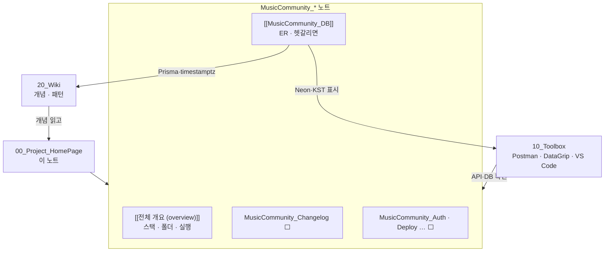

---
aliases:
  - 00_Project_HomePage — 프로젝트
  - Project HomePage
tags:
  - HomePage
related:
  - "[[전체 개요 (overview)]]"
  - "[[MusicCommunity_DB]]"
  - "[[00_JS_Ecosystem_HomePage]]"
  - "[[00_NestJS_Ecosystem_HomePage]]"
  - "[[00_Tools_Ecosystem_HomePage]]"
  - "[[00_DB_HomePage]]"
cssclasses:
  - max
  - table-max
  - table-wrap
---
# 00_Project_HomePage — 프로젝트

> [!info]
> `20_Wiki`는 **언어·프레임워크 개념**을, `30_Project`는 **실제로 만든 앱 하나**를 기록하는 폴더다.  
> 모노레포 구조, 이 앱만의 스키마·인증·배포, 단계별 구현, 트러블슈팅처럼 "이 프로젝트에서만 그렇게 했다"는 내용이 여기 해당한다.

```txt
폴더 위치: 30_Project/  (하위 폴더 없음 — Obsidian이 폴더를 파일보다 위에 보여서)
파일 순서: 00_Project_HomePage.md 맨 위 → 프로젝트별 MusicCommunity_주제.md

이 폴더에 없는 것:
  JwtGuard·DTO·Prisma 문법 개념     → [[00_NestJS_Ecosystem_HomePage]] · [[00_DB_HomePage]]
  Next fetch · Server Actions 개념  → [[00_JS_Ecosystem_HomePage]]
  Postman · DataGrip · VS Code       → [[00_Tools_Ecosystem_HomePage]]
  Docker · 배포 플랫폼 일반 개념      → [[00_DevOps_HomePage]] · [[00_Deployment_HomePage]]

원본 상세 문서(길게): music-community 레포 apps/docs/ (gitignore · 로컬 작업용)
vault 노트: 요약·ER·헷갈림·진행만 옮겨 둠 — [[MusicCommunity_DB]]처럼
```



---

# 프로젝트 목록 — 지금 있는 것만

| 접두사 | 프로젝트 | 진입 노트 |
|---|---|---|
| **MusicCommunity_** | Next.js + NestJS 모노레포 · 음악 추천 커뮤니티 | [[전체 개요 (overview)]] ⭐ |

```txt
프로젝트가 늘어나면 OtherApp_Overview.md 처럼 접두사만 바꿔 같은 폴더에 추가
(31_ 하위 폴더는 쓰지 않음 — HomePage가 항상 맨 위에 오도록)
```

---

# MusicCommunity ⭐️⭐️⭐️⭐️

## 한눈에

| 항목 | 내용 |
|---|---|
| Web | Next.js 16 · Tailwind 4 · `:3031` · Vercel |
| API | NestJS 11 · Prisma 7 · Swagger · `:3030` · Railway |
| DB | PostgreSQL 17 · Docker `:5433` · Neon (prod) |
| 구조 | pnpm 모노레포 — `apps/api` + `apps/web` |
| 방향 | **Nest 집중** — 인증·DB·DTO는 API, Web은 UI + Bearer fetch |
| 지금 | 11+ ✅ → **12 Chat(댓글)** ⬜ |

```txt
라이브 (참고): music-community-web.vercel.app · api-production-4b66.up.railway.app
```

## 노트 — 있는 것 · 옮길 것

| 순서 | 노트 | 핵심 내용 | 상태 |
|:---:|---|---|:---:|
| 1 | [[전체 개요 (overview)]] ⭐ | 스택 · mermaid · 폴더 트리 · 실행 순서 | ⬜ |
| 2 | [[MusicCommunity_DB]] ⭐ | 전체 ER · 헷갈리면 · SavedCard `customization` · Chat/Friends 예정 | ✅ |
| 3 | MusicCommunity_Changelog | 단계별 진행·완료 (`apps/docs/changelog.md` 요약) | ⬜ |
| 4 | MusicCommunity_Auth | 이 앱 JwtGuard · login · `/auth/me` · lastActiveAt | ⬜ |
| 5 | MusicCommunity_Deploy | Railway · Vercel · Neon migrate | ⬜ |
| 6 | MusicCommunity_Chat · Friends | 12~14 댓글 · 친구 · 그룹방 | ⬜ |

```txt
노트 이름 패턴

MusicCommunity_Overview   큰 틀 · 스택 · 실행
MusicCommunity_Changelog  단계 번호 · ✅/⬜
MusicCommunity_DB         스키마·관계·헷갈리는 필드만
MusicCommunity_Auth …     주제별 — 필요할 때 추가
```

---

# 빠른 진입 — 상황별

| 하고 싶은 일 | 먼저 볼 노트 |
|---|---|
| 프로젝트 전체 구조·스택·실행 | [[전체 개요 (overview)]] |
| ER · `createdAt` vs `lastActiveAt` · SavedCard | [[MusicCommunity_DB]] |
| Comment vs RoomMessage · Friendship vs Block | [[MusicCommunity_DB]] § 헷갈리면 |
| Nest JWT · Guard (개념) | [[NestJS_JwtGuard]] · [[Auth_Concept]] |
| Next fetch · Bearer (개념) | [[NextJS_API_Client]] · [[NextJS_TokenStorage]] |
| Prisma · timestamptz (개념) | [[NestJS_Prisma]] · [[Snippet_date-statistics-pattern]] |
| 로컬 DB 띄우기 · migrate | [[Docker_Compose]] · [[DataGrip_Basics]] |
| API 요청 테스트 | [[Postman_Basics]] · [[Postman_Environments]] |
| 다음 구현 단계 확인 | MusicCommunity_Changelog ⬜ (또는 레포 `apps/docs/changelog.md`) |

---

# Wiki · Toolbox와의 경계

| Wiki (`20_Wiki`) | Toolbox (`10_Toolbox`) | Project (`30_Project`) |
|---|---|---|
| JwtGuard가 뭔지 | Postman으로 `/auth/login` 호출 | 이 앱 Guard·touchLastActiveAt 적용 위치 |
| NextJS API Client 패턴 | DataGrip `music-community-local` | 이 앱 `schema.prisma` · [[MusicCommunity_DB]] |
| Prisma relation 문법 | KST `SET TIME ZONE` | 이 앱 ER · `Comment`/`RoomMessage` 이름 |
| Monorepo pnpm 개념 | VS Code eslint 설정 | `apps/api` + `apps/web` 실제 구조 |
