---
aliases:
  - overview
tags:
  - Project
related:
  - "[[00_Project_HomePage]]"
  - "[[00_JS_Ecosystem_HomePage]]"
  - "[[00_NestJS_Ecosystem_HomePage]]"
---


**이 파일 = 프로젝트 큰 틀·집합체.** mermaid·표로 **헷갈리는 것** 한눈에. 상세는 `[struct.md](./struct.md)`, `[auth.md](./auth.md)`, `[routes.md](./routes.md)`, `[ui.md](./ui.md)` 등.  
**진행·완료 체크·날짜** — `[changelog.md](./changelog.md)` (여기엔 안 넣음).

> **방향 (재시작 2026-06-24)**  
> `**backup/main`** 은 ③ — Nest 도메인 + **Web Prisma 예외**(Auth.js 가입·닉네임).  
> **이후 재구현(`main`)은 ① Nest 집중** — **인증·User·DB 규칙 전부 Nest**, Web·앱은 **UI + fetch(Bearer) 만.

> **Auth (`main`)** — **Auth.js Adapter 스키마 ❌** · Prisma `**User`만** (Nest `POST /auth/` + JWT). Web Auth.js·`@auth/prisma-adapter`·`Account`/`VerificationToken` **안 씀**.  
> 로그인 후 돌아갈 path — Web URL 쿼리는 **`next`만** (`callbackUrl` · `redirectTo` **안 씀**). `lib/redirect.ts` · [`ui.md`](./ui.md).

> **역할(권한) Guard — NestJS 공식 권장** · `AdminGuard` 단일 클래스 **대신** `@Roles()` + `RolesGuard` + `Reflector`
>
> - **인증** (*authentication* — **“로그인했는가”**) — `JwtAuthGuard`: `Authorization: Bearer` JWT 검증 → `request.user` (`sub` · `role`)
> - **인가** (*authorization* — **“이 역할이 이 API를 써도 되는가”**) — `RolesGuard` + `@Roles('admin')`: JWT `role`과 비교
> - **Admin (8~)** — `@UseGuards(JwtAuthGuard, RolesGuard)` + `@Roles('admin')` (인증 **후** 인가)

---

## 기술 스택 · 앱 구조


| 영역      | 기술                                                             | 로컬 실행                                                 |
| ------- | -------------------------------------------------------------- | ----------------------------------------------------- |
| Web     | Next.js 16 · Tailwind 4                                        | 루트 `pnpm dev:web` · **3031**                          |
| API     | NestJS 11 · Prisma 7 · **ValidationPipe** · **Swagger** `/api` | 루트 `pnpm dev:api` · **3030**                          |
| DB      | PostgreSQL 17                                                  | **Docker** `docker compose up -d` · 호스트 **5433** (2~) |
| compose | `docker-compose.yml` (루트)                                      | **Postgres만** — Nest/Web은 컨테이너 아님                     |


> Docker·env·포트 상세: `[install.md](./install.md)`

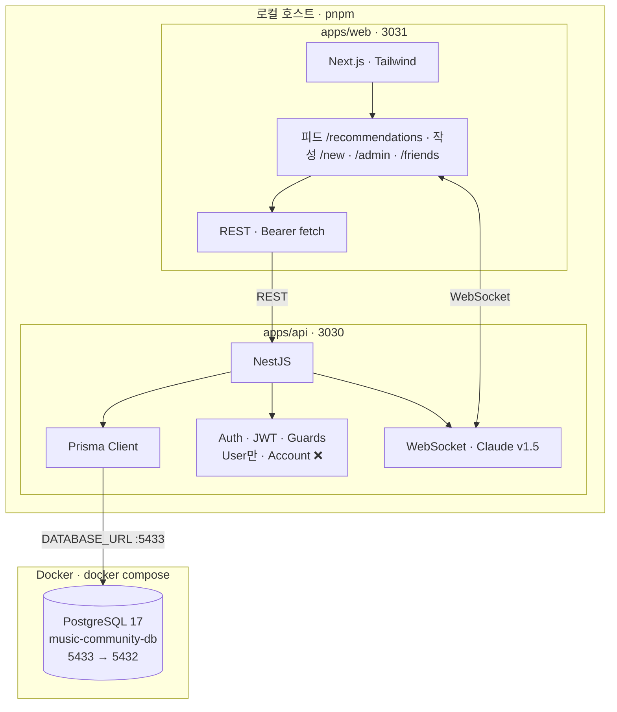


> JWT · Guard · Bearer: `[api_auth_flow.md](./api_auth_flow.md)` · URL: `[routes.md](./routes.md)`

### 모노레포란?

**한 Git 저장소 안에 `apps/api`(Nest)와 `apps/web`(Next)를 같이 두는 구조.**

### 왜 모노레포?

- **Nest 집중** — DB · Prisma · DTO 검증 · **인증(로그인)** · **인가(역할)** 은 전부 `apps/api`. Web·앱은 **화면 + `fetch`(Bearer)** 만.
- **한 번에 실행** — 루트에서 API·Web 동시에 띄움 (아래).
- **경로 맞추기** — REST path와 Web URL 세그먼트를 같게 (`/recommendations` …). 상세 `[routes.md](./routes.md)`.

### 실행 (루트)

**로컬 개발 순서:** DB 먼저 → `pnpm install` → API · Web 각각 실행.

```bash
# 1) PostgreSQL (Docker)
docker compose up -d          # :5433 → 컨테이너 :5432
# env: apps/api/.env — POSTGRES_* · DATABASE_URL (docker-compose가 apps/api/.env 읽음)

# 2) 의존성 — 항상 저장소 루트에서
pnpm install                  # pnpm-workspace.yaml 기준 apps/* 한 번에

# 3) API · Web (터미널 2개)
pnpm dev:api                  # Nest --watch → http://localhost:3030
pnpm dev:web                  # Next dev     → http://localhost:3031
```


| 파일                        | 역할                                                                                                                                      |
| ------------------------- | --------------------------------------------------------------------------------------------------------------------------------------- |
| `**pnpm-workspace.yaml**` | 모노레포 **작업 공간** — `apps/*` · `packages/*` 패키지 등록. `allowBuilds`로 `prisma` · `bcrypt` 등 네이티브 빌드 허용                                        |
| `**package.json` (루트)**   | **실행 위임만** — `dev:api` → `pnpm --filter api start:dev`, `dev:web` → `pnpm --filter web dev`. Nest/Next CLI는 각 `apps/*/package.json`에 있음 |
| `**docker-compose.yml`**  | 로컬 **PostgreSQL 17** — `music-community-db`, 호스트 **5433**, volume `db_data`, healthcheck. Prisma는 Nest(`apps/api`)만 사용                  |
| `apps/api/package.json`   | Nest 빌드·실행 · `prisma` 스크립트                                                                                                              |
| `apps/web/package.json`   | Next 16 · Tailwind 4                                                                                                                    |


#### 루트 — `music-community/`

```txt
music-community/
├── pnpm-workspace.yaml     # ★ workspace: apps/* · packages/*
├── package.json            # ★ dev:api · dev:web (filter 위임)
├── pnpm-lock.yaml
├── docker-compose.yml      # ★ Postgres :5433 · apps/api/.env
├── apps/
│   ├── api/                # Nest · Prisma · auth
│   ├── web/                # Next
│   └── docs/               # overview · changelog …
└── packages/               # (공유 패키지 — 있으면)
```

**env (로컬):**


| 앱            | 파일                    | 주요 키                                                              |
| ------------ | --------------------- | ----------------------------------------------------------------- |
| API + Docker | `apps/api/.env`       | `POSTGRES_`* · `DATABASE_URL` · `API_JWT_SECRET` · `FRONTEND_URL` |
| Web          | `apps/web/.env.local` | `NEXT_PUBLIC_API_URL` (= `http://localhost:3030`)                 |


### 폴더 스냅샷 — `apps/` (6단계 완료 · 7단계 진행 예정)

> **단계 번호·완료 여부** — `[changelog.md](./changelog.md)`.  
> 아래는 지금까지 쌓인 트리. 7단계에서 `authorId` · reactions 등 **추가 예정**.

#### `apps/api/`

```txt
apps/api/
├── prisma.config.ts
├── prisma/
│   ├── schema.prisma             # Recommendation · Reaction · User (6~)
│   └── migrations/
├── nest-cli.json
└── src/
    ├── main.ts                   # CORS · ValidationPipe · Swagger · listen
    ├── app.module.ts             # Config · Prisma · Recommendations · Auth (6~)
    ├── config/                   # env.keys · Joi validation
    ├── prisma/                   # PrismaModule · PrismaService
    ├── health/                   # GET /health
    ├── recommendations/          # 2~2a GET · POST · MOODS · DTO
    │   ├── constants/moods.ts
    │   ├── dto/
    │   ├── recommendations.controller.ts
    │   └── recommendations.service.ts
    ├── auth/                     # 6~ — POST /auth/* · JwtAuthGuard · RolesGuard
    │   ├── auth.module.ts · auth.service.ts · auth.controller.ts
    │   ├── jwt-auth.guard.ts · roles.guard.ts · jwt-payload.ts
    │   ├── dto/                  # login · register · auth-response
    │   └── decorators/           # @Roles · @UserId · @Public
    └── generated/prisma/
```

#### `apps/web/lib/`

```txt
apps/web/lib/
├── fetchApi.ts              # getApiBaseUrl() — api.ts · authFetch 공용
├── types.ts · apiTypes.ts · mapRecommendation.ts
├── authToken.ts             # localStorage mc_access_token (6~)
├── redirect.ts              # 로그인·가입 후 ?next= path (7~ UI)
├── api.ts                   # fetchRecommendations · login · register
└── authFetch.ts             # Bearer fetch (6~ · 7 POST에 사용)
```

`moods.ts` · `date.ts` — **5단계** FeedCard·`/new` UI. `fetchAPI<T>` 등은 **반복 더 생기면** `fetchApi.ts`에 추가.

#### `apps/web/app/` · `components/`

```txt
apps/web/
├── app/
│   ├── layout.tsx              # AppHeader (6~)
│   ├── login/ · register/      # 6~
│   ├── recommendations/        # 4 피드 · 5 /new (POST는 7~)
│   └── page.tsx · HealthCheck.tsx
└── components/
    ├── layout/AppHeader.tsx
    └── recommendations/        # FeedCard · FeedList (3~)
```

**Web env:** `apps/web/.env.local` — `NEXT_PUBLIC_API_URL` 만 (Auth.js·Prisma ❌)

---

## 역할 분담 · 개발 순서 — Next vs Nest

> **① Nest 집중 — 규칙이 번호보다 우선.** 상세 체크: `[struct.md](./struct.md)`  
> **번호·완료·날짜** — `[changelog.md](./changelog.md)`. 상단 **폴더 스냅샷** = 현재 코드 트리만.


|                      | **apps/web (Next.js · 3031)**                                        | **apps/api (NestJS · 3030)**                               |
| -------------------- | -------------------------------------------------------------------- | ---------------------------------------------------------- |
| **한 줄**              | 화면 · 라우팅 · 폼 · **표시**                                                | **Prisma · 규칙 · 검증 · REST**                                |
| DB                   | ❌ 직접 접근 없음                                                           | ✅ **단일** schema · migrate                                  |
| API 호출               | `fetchApi.getApiBaseUrl()` · `**api.ts` · `authFetch` · `adminFetch` | Controller · DTO · **ValidationPipe** · **Swagger** `/api` |
| **허용 값** (`MOODS` …) | ❌ 정의 안 함 — **5단계~** 칩용 `moods.ts` (Nest 복사)                          | ✅ `**constants/`** + DTO `**@IsIn\*\`                      |
| **UI만** (날짜 포맷 등)    | ✅ `date.ts` · `moods.ts` 칩 렌더                                        | ❌                                                          |


**① 기억:** 규칙·목록·검증 = **Nest**. Web = `fetchRecommendations()` + 화면. 상세: 「Web lib 공통 틀」· 위 **① 원칙**

### 로드맵 — 단계 번호 (Nest · Web)

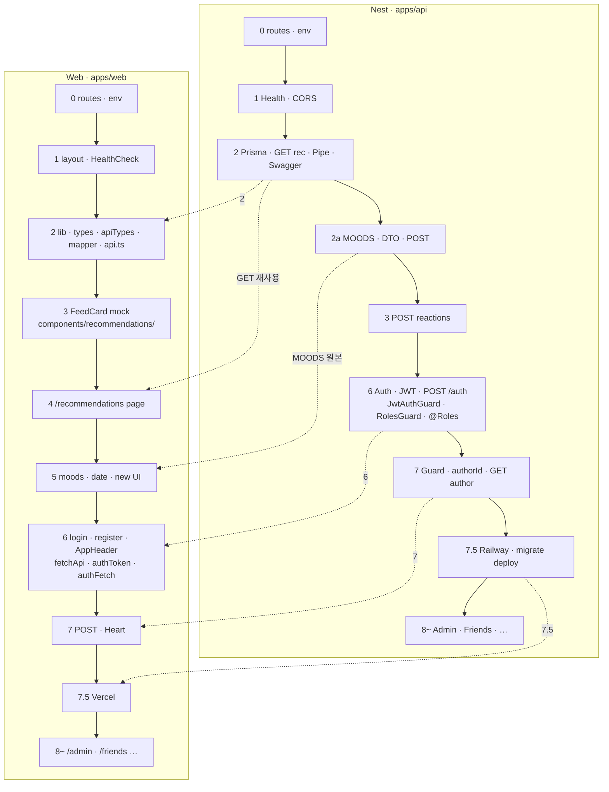


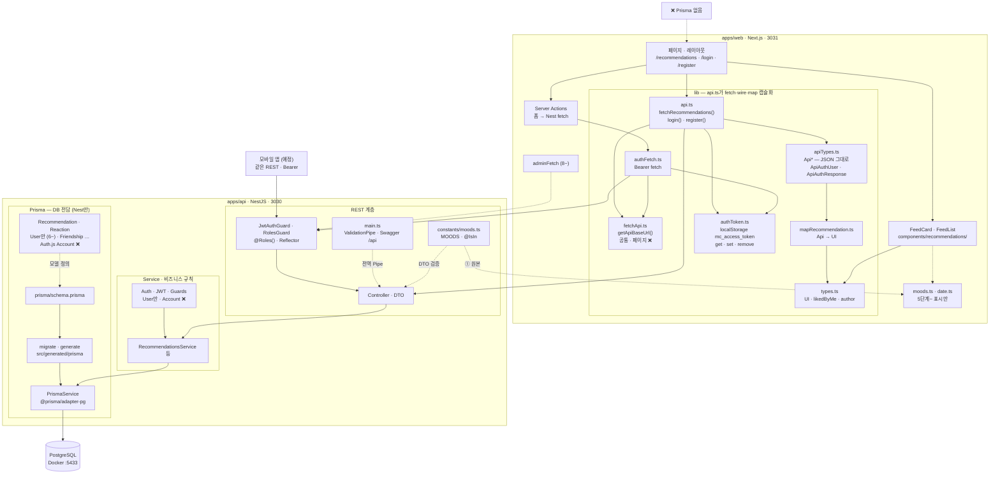


### 기능별 — 어디에 코드?


| 기능                             | Nest | Web          | 비고                                                                 |
| ------------------------------ | ---- | ------------ | ------------------------------------------------------------------ |
| 페이지·URL·UI                     |      | ✅            | `app/**/page.tsx`, `components/recommendations/` 등                 |
| **가입 · 로그인 · OAuth · 토큰**      | ✅    | ✅ UI + fetch | `POST /auth/` · Web은 세션/토큰 저장만 · 리다이렉트 쿼리 **`next`만** (`lib/redirect.ts`) |
| **닉네임 · 내 프로필**                | ✅    | ✅ UI + fetch | `PATCH /users/me` 등                                                |
| 피드 **조회** (공개)                 | ✅    | ✅ 호출         | `GET /recommendations` — `**apiTypes` → mapper → `types`           |
| **Web UI 타입** (`likedByMe` 등)  |      | ✅            | `lib/types.ts` — API JSON과 **1:1 아님**                              |
| 글 **작성** · 좋아요                 | ✅    | ✅ 호출         | POST · `authFetch`                                                 |
| 친구 · Admin                     | ✅    | ✅ 호출         | `/friends`, `/admin`                                               |
| 타인 프로필 **조회**                  | ✅    | ✅ 호출         | `GET /users/:id`                                                   |
| **DTO · body 검증**              | ✅    | —            | `ValidationPipe` · `dto/*.dto.ts` · `**MOODS` `@IsIn`              |
| **허용 값 (MOODS 등)**             | ✅    | ✅ 표시만        | Nest `constants/` **원본** — Web `moods.ts`는 5단계~ **복사**             |
| **날짜·칩 표시**                    |      | ✅            | `date.ts` · `moods.ts` — **포맷·UI만** (검증 ❌)                         |
| **API 문서 (Swagger)**           | ✅    | —            | `main.ts` · [http://localhost:3030/api](http://localhost:3030/api) |
| **스키마 · migrate**              | ✅    | ❌            | `apps/api/prisma/`만                                                |
| WebSocket · Claude · 댓글·방 (예정) | ✅    | UI만          | 실시간·AI는 Nest                                                       |


### “새 기능 넣을 때” 결정 트리

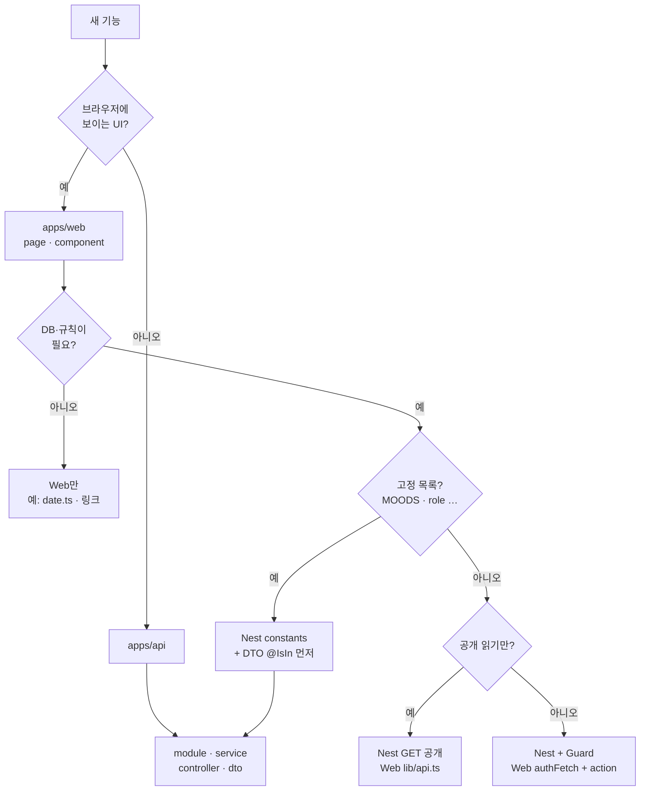


**한 줄:** DB·비즈니스 규칙·**허용 목록(MOODS)** → **항상 Nest 먼저.** Web은 화면·표시·`fetch`만.

### ① 원칙 — 뭐를 먼저 만들까


| 뭐                                      | 먼저 어디                       | 나중 Web                          |
| -------------------------------------- | --------------------------- | ------------------------------- |
| DB · migrate · Prisma                  | Nest                        | ❌                               |
| API · Guard · DTO · **ValidationPipe** | Nest                        | `fetch` / `authFetch`만          |
| **허용 값** (`MOODS`, `role` …)           | Nest `constants/` + `@IsIn` | `moods.ts`는 **칩 UI용 복사** (5단계~) |
| **날짜 포맷** (`오늘`, `YYYY.MM.DD`)         | —                           | Web `date.ts` (3~5단계 FeedCard)  |
| 피드 **조회** wire·mapper                  | Nest GET 먼저                 | `api.ts` 체인 (2단계 lib)           |


**잘못된 순서:** Web `moods.ts` 먼저 → Nest DTO 나중  
**맞는 순서:** Nest `MOODS` → DTO `@IsIn` → POST → (UI 때) Web `moods.ts` · `date.ts`

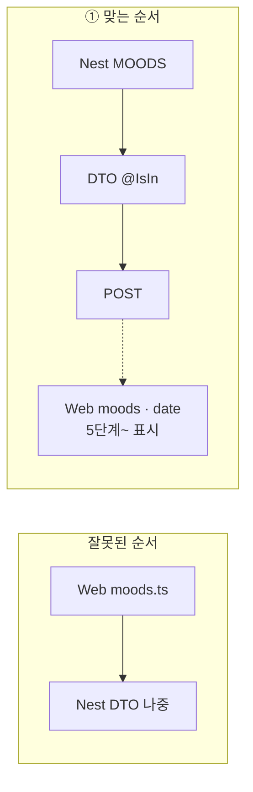


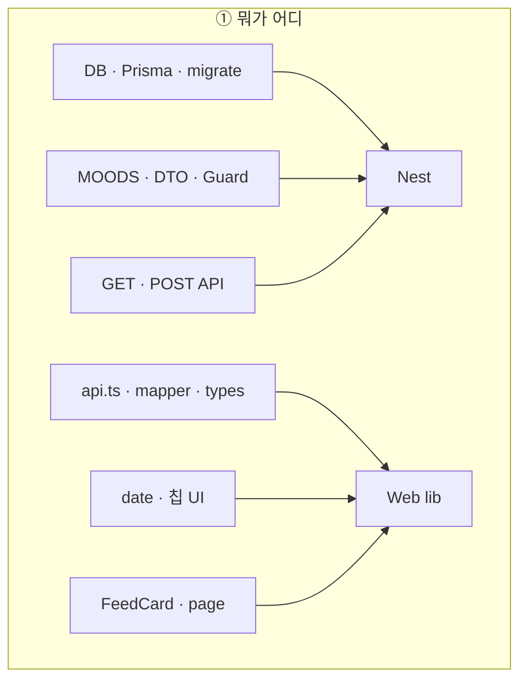


### 의존 규칙 (로드맵 번호와 맞춤)


| 규칙                | 내용                                                                                         |
| ----------------- | ------------------------------------------------------------------------------------------ |
| **Nest 먼저**       | 상수·DTO·`POST`·Guard — 같은 `#` 안에서도 **API가 Web보다 앞**                                         |
| **공개 읽기**         | Nest `GET` (2단계) → Web `lib/api.ts` → **(4) `/recommendations` 페이지**                       |
| **인증** (로그인·JWT)  | Nest `POST /auth` · `JwtAuthGuard` · Web `fetchApi` · `authToken` · `authFetch` · `/login` |
| **인가** (역할·admin) | `RolesGuard` · `@Roles()` · `@Reflector` (8~ Admin: `@Roles('admin')`)                     |
| **쓰기·좋아요·작성자**    | 7 — `JwtAuthGuard` · `authorId` · `GET include: { author }` · 폼 POST · Heart E2E           |
| **첫 배포**          | **7.5** — Vercel + Railway + Neon                                                          |


> **4단계:** Nest `include: { author }` 없음 — `authorId`는 7단계. 피드 `@닉네임` = **7** (지금 `@익명` 의도).

### 이 문서 — 아래로 읽는 순서


| 순서  | 섹션                           | 왜 이 순서                                        |
| --- | ---------------------------- | --------------------------------------------- |
| ①   | **기술 스택 · 앱 구조**             | Web · API · DB · 포트 · 한 장 mermaid — **먼저 그림** |
| ②   | **모노레포 · 실행 · 폴더** (위)       | pnpm · docker · 루트 파일 · `apps/` 트리            |
| ③   | **역할 분담 · 개발 순서** (지금)       | Nest vs Web · 로드맵 · 원칙 · changelog            |
| ④   | **Nest API 공통 틀**            | 요청 흐름 · Pipe · Swagger · Guard(인증·인가)         |
| ⑤   | **Web lib 공통 틀**             | `api.ts` fetch 체인 · `fetchApi` · mapper       |
| ⑥   | **Auth**                     | JWT · localStorage · `ApiAuth*` · Guard 상세    |
| ⑦   | **Web 라우팅** · **components** | Link · `useRouter` · FeedCard 폴더              |
| ⑧   | **Prisma**                   | schema · ER · User FK (`authorId` / `userId`) |
| ⑨   | **URL · Web fetch**          | path · Bearer 표                               |
| ⑩   | 사용자 여정 · **배포**              | soft gate · 7.5                               |


---

## Nest API 공통 틀 — `main.ts` · ValidationPipe · Swagger

> **위치:** 전역 설정은 **별도 `swagger.ts` 없이 `main.ts`** 에 둠. 모듈·도메인 코드만 `src/*/` 폴더.

### 요청이 지나는 순서

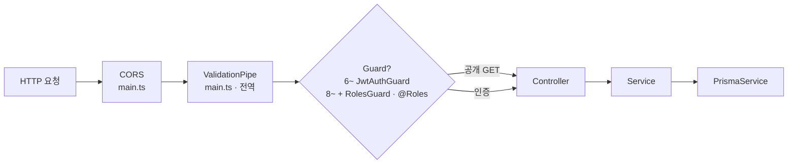


| 계층            | 파일                  | 하는 일                                                                        |
| ------------- | ------------------- | --------------------------------------------------------------------------- |
| **bootstrap** | `main.ts`           | CORS · **ValidationPipe** · **Swagger** · `listen(PORT)`                    |
| **모듈**        | `app.module.ts`     | `ConfigModule` · `PrismaModule` · `RecommendationsModule` …                 |
| **env**       | `config/env.`       | Joi — `.env` 검증 (`ConfigService`)                                           |
| **REST**      | `*/*.controller.ts` | path · HTTP 메서드 · `@UseGuards` · `@Roles`                                   |
| **Guard**     | `auth/*.guard.ts`   | `JwtAuthGuard` (**인증** — 로그인·JWT) · `RolesGuard` + `@Roles()` (**인가** — 역할) |
| **DTO**       | `dto/*.dto.ts`      | body 형식 — **Pipe가 검증** (`class-validator`)                                  |
| **비즈니스**      | `*.service.ts`      | Prisma 호출 · 규칙                                                              |
| **DB**        | `prisma/`           | schema · `PrismaService`                                                    |


### Auth Guard — `JwtAuthGuard` · `@Roles()` · `RolesGuard` (6~)

> **인증 vs 인가** — **인증**: Bearer로 **누구인지**(로그인했는가). **인가**: `@Roles`로 **그 사람이 이 API를 써도 되는지**(예: admin만). Nest [RBAC 가이드](https://docs.nestjs.com/security/authorization#role-based-authorization)와 동일. `AdminGuard` 단독 클래스 **안 씀**.

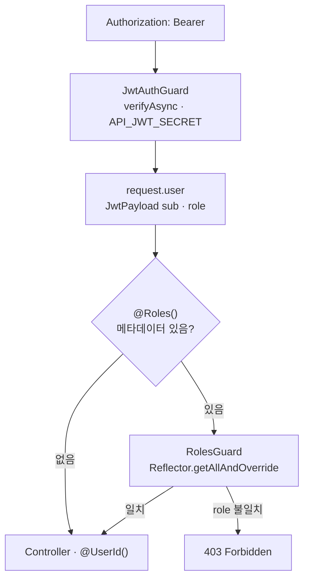


| 파일                                     | 역할                                        |
| -------------------------------------- | ----------------------------------------- |
| `auth/jwt-payload.ts`                  | `{ sub, role }` — JWT · `request.user` 공용 |
| `auth/jwt-auth.guard.ts`               | Bearer 검증 → `request.user`                |
| `auth/decorators/roles.decorator.ts`   | `@Roles('admin')` — `SetMetadata`         |
| `auth/roles.guard.ts`                  | `Reflector`로 `@Roles` 읽고 `user.role` 비교   |
| `auth/decorators/user-id.decorator.ts` | `@UserId()` → `request.user.sub`          |
| `types/express.d.ts`                   | `Request.user?: JwtPayload`               |


```ts
// 일반 로그인 사용자 (7~)
@UseGuards(JwtAuthGuard)
@Post()
create(@UserId() userId: string) { ... }

// 관리자만 (8~)
@UseGuards(JwtAuthGuard, RolesGuard)
@Roles('admin')
@Get()
findAllForAdmin() { ... }
```

**6단계 auth:** 상단 「6단계 — `apps/web/`」· 본문 「Auth — 비밀번호 · JWT · Guard」

### ValidationPipe (전역 · `main.ts`)

`POST`·`PATCH` body가 **DTO와 다르면 400** — Service까지 안 감.


| 옵션                     | 의미                   |
| ---------------------- | -------------------- |
| `whitelist`            | DTO에 없는 필드 제거        |
| `forbidNonWhitelisted` | 여분 필드 있으면 **거부**     |
| `transform`            | JSON → DTO 클래스·타입 변환 |


- **2단계:** `GET /recommendations`만 있어도 **미리 켜 둠** (2b `POST`·`CreateRecommendationDto` 대비)
- **검증 규칙:** DTO · `**MOODS` `@IsIn` (`recommendations/constants/`) — 상세 `[dto.md](./dto.md)`

### Swagger (OpenAPI · `main.ts`)


| 항목           | 값                                                                    |
| ------------ | -------------------------------------------------------------------- |
| **문서 UI**    | [http://localhost:3030/api](http://localhost:3030/api)               |
| **코드 위치**    | `main.ts` — `DocumentBuilder` · `SwaggerModule.setup('api', …)`      |
| **버전**       | `0.0.1` — `package.json`과 동일 (MVP 전)                                 |
| **CLI 플러그인** | `nest-cli.json` — DTO·컨트롤러 주석 → 스키마 자동                               |
| **Bearer**   | `addBearerAuth('access-token')` — `POST /recommendations` Try it out |


로컬에서 API 스펙·Try it out 확인용. Web·앱은 이 문서를 **직접 쓰지 않고** `fetch`만.

---

## Web lib 공통 틀 — `fetchApi` · `api.ts` · apiTypes → mapper → `types`

> **한 줄:** 페이지는 `fetchRecommendations()` **만** 부른다.  
> `**api.ts`** = `fetch` → `**apiTypes`로 받기** → **mapper로 변환** 을 **한 함수 안에 캡슐화**.  
> `**fetchApi.ts`** = `getApiBaseUrl()` — `api.ts` · `authFetch`가 **import** (페이지는 직접 안 씀).  
> 피드 카드 props = `types.Recommendation`— API JSON 그대로 FeedCard에 안 넣음. `likedByMe`· 필드 표:`[struct.md](./struct.md)`·`[routes.md](./routes.md)` 「Web 타입」

### `fetchApi.ts` — 공통 URL (지금은 이것만)


|            |                                                                         |
| ---------- | ----------------------------------------------------------------------- |
| **export** | `getApiBaseUrl()` — `NEXT_PUBLIC_API_URL` 검증 · trailing `/` 제거          |
| **쓰는 쪽**   | `api.ts` (`fetchRecommendations`, `login`, `register`) · `authFetch.ts` |
| **페이지**    | ❌ 직접 import 안 함                                                         |
| **나중에**    | `fetchAPI<T>` · `ApiError` — fetch 패턴이 **2곳 이상** 반복될 때 같은 파일에 추가        |


### lib 파일 — 정의 vs 실행


| 파일                     | 역할                                        | 페이지가 직접 부름?                                       |
| ---------------------- | ----------------------------------------- | ------------------------------------------------- |
| `fetchApi.ts`          | `getApiBaseUrl()` — URL 공통                | ❌ `api.ts` · `authFetch`만 import                  |
| `**api.ts`             | **진입점** — `fetchRecommendations()` · auth | ✅ `await fetchRecommendations()` · login/register |
| `apiTypes.ts`          | `Api` 타입 정의 (wire)                        | ❌ `api.ts` 안에서 `as`                               |
| `mapRecommendation.ts` | Api → UI 변환                               | ❌ `api.ts`가 `mapRecommendations` 호출               |
| `types.ts`             | `Recommendation` UI shape                 | ❌ mapper **반환 타입** · FeedCard props               |
| `authToken.ts`         | `mc_access_token` localStorage            | ❌ `api.ts` · `authFetch`                          |
| `authFetch.ts`         | Bearer `fetch`                            | ❌ Server Action 등에서 import                        |


**헷갈리지 말 것:** 제목의 `apiTypes → mapper → types`는 `**api.ts` 함수 안에서 일어나는 순서**.  
`api.ts`가 빠진 게 아니라 **그 순서를 묶어 주는 껍데기가 `api.ts`.

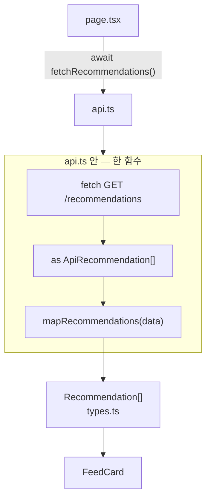


### 한눈에 — 3장만 (헷갈릴 때 여기)

**① 전체 — 페이지는 `api.ts`만 (가로)**

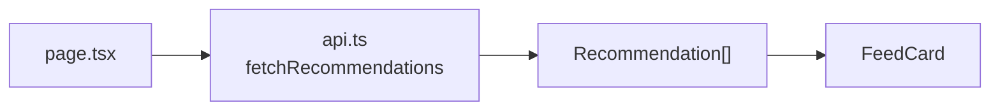


**② `api.ts` 안 — ⭐ fetch · wire · map (세로)**

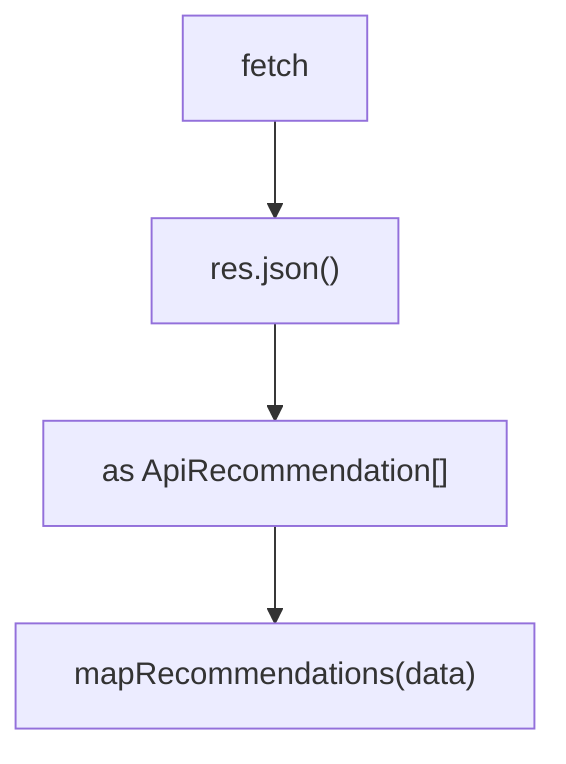


| 단계    | 코드                        | 파일 개념                  |
| ----- | ------------------------- | ---------------------- |
| fetch | `${base}/recommendations` | `api.ts`               |
| wire  | `as ApiRecommendation[]`  | `apiTypes.ts`          |
| map   | `mapRecommendations`      | `mapRecommendation.ts` |
| 결과    | `Recommendation[]`        | `types.ts`             |


**③ mapper — 배열 (가로)**

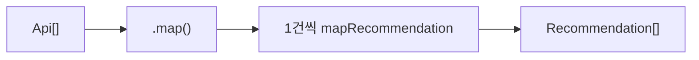


| 순서  | 파일                     | 하는 일           |
| --- | ---------------------- | -------------- |
| 1   | `api.ts`               | fetch          |
| 2   | `apiTypes`             | JSON 타입 붙이기    |
| 3   | `mapRecommendation.ts` | Api → UI 변환    |
| 4   | `types.ts`             | FeedCard props |


### `fetchRecommendations` — 전체 코드 흐름

```ts
// api.ts — getApiBaseUrl은 fetchApi.ts에서
import { getApiBaseUrl } from './fetchApi';

export async function fetchRecommendations(...): Promise<Recommendation[]> {
  const res = await fetch(`${getApiBaseUrl()}/recommendations`, { ... });  // fetch
  const data = (await res.json()) as ApiRecommendation[];                 // ① apiTypes
  return mapRecommendations(data, currentUserId);                           // ② mapper
}
```

페이지는 **위 함수 하나**만 호출 — `apiTypes`·mapper 파일을 page에서 import하지 않음 (피드 조회 시).

### `mapRecommendations` — 왜 `.map`?

```ts
export function mapRecommendations(
  apis: ApiRecommendation[],
  currentUserId?: string,
): Recommendation[] {
  return apis.map((api) => mapRecommendation(api, currentUserId));
}
```


| 함수                   | 입력     | 출력                    |
| -------------------- | ------ | --------------------- |
| `mapRecommendation`  | **1건** | **1건** — 변환 규칙        |
| `mapRecommendations` | **배열** | **배열** — `api.ts`가 호출 |


mapper 필드 (`likeCount` · `author` · `likedByMe?`) — `[struct.md](./struct.md)`

### `types.ts`에 두는 타입


| 타입                         | 용도                                                |
| -------------------------- | ------------------------------------------------- |
| `Mood` · `Author`          | UI 전용 (`moods`는 `string[]` — 5단계 `moods.ts`에서 좁힘) |
| `Recommendation`           | 피드 카드 **1건** props                                |
| `CreateRecommendationBody` | 작성 `POST` — Nest DTO와 **동일 필드**                   |


`moods.ts` · `date.ts` — **표시용** (칩·날짜). `**fetchApi` · `authToken` · `authFetch` — 아래 「Auth — 비밀번호 · JWT · Guard」.

---

## Auth — 비밀번호 · JWT · Guard · apiTypes

> Web은 **Auth.js 세션 ❌** — Nest `POST /auth/`* → JSON 받아 `**localStorage`** → `**authFetch`** Bearer.  
> bcrypt 상세: `[auth.md](./auth.md)`· Guard 상세:`[api_auth_flow.md](./api_auth_flow.md)`

### 로그인 후 리다이렉트 — 쿼리 `next` (Web만)

Auth.js `callbackUrl` · 다른 프레임워크 `redirectTo` 와 **같은 개념**이지만, 이 프로젝트 Web URL 쿼리 이름은 **`next` 하나로 통일**한다.


| 항목 | 값 |
| --- | --- |
| 쿼리 키 | `next` (**`callbackUrl` · `redirectTo` 사용 안 함**) |
| 기본 이동 path | `/recommendations` |
| 구현 | `apps/web/lib/redirect.ts` — `buildLoginHref` · `buildRegisterHref` · `getRedirectPathFromSearchParams` |
| UI·올리기 Dialog | [`ui.md`](./ui.md) |


예: 비로그인이 올리기 → `/login?next=/recommendations/new` → 로그인·가입 성공 후 작성 페이지.

### 비밀번호 → JWT → localStorage → JwtAuthGuard (한 장)

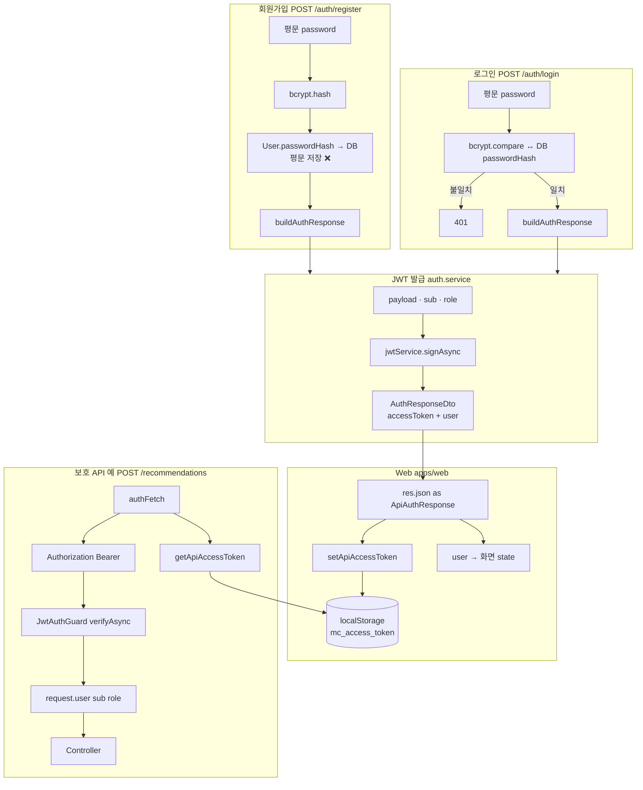


### `ApiAuthUser` / `ApiAuthResponse` — 왜 `apiTypes.ts`에?

login · register **성공 시** 서버 JSON:

```json
{
  "accessToken": "eyJ...",
  "user": { "id": "...", "email": "...", "nickname": "...", "role": "user" }
}
```

`apiTypes.ts` = Nest JSON을 `res.json()`으로 받을 때 붙이는 **wire 타입** 모음.


| 타입                  | 언제                        |
| ------------------- | ------------------------- |
| `ApiRecommendation` | 피드 `GET /recommendations` |
| `ApiAuthResponse`   | login · register **응답**   |


Nest `AuthResponseDto`와 **모양은 같음**. Nest는 Swagger 때문에 **class**, Web은 **type**만.

### 왜 login / logout은 `apiTypes`에 없나?


|              | Nest `dto/`                 | Web `apiTypes.ts`                      |
| ------------ | --------------------------- | -------------------------------------- |
| **적는 것**     | 서버가 **받는** 요청 + **내려주는** 응답 | 클라이언트가 **받는** 응답 JSON만                 |
| **login**    | `LoginDto` — `@IsEmail` 검증  | `login(email, password)` 인자로 충분        |
| **register** | `RegisterDto`               | `register(email, password, nickname)`  |
| **logout**   | (없음 — JWT만 쓰면 서버 API 필수 아님) | `removeApiAccessToken()` — **JSON 없음** |


- `LoginDto` / `RegisterDto` → 서버로 **보내는** body 규칙
- `ApiAuthResponse` → 서버에서 **받는** body 규칙

```ts
// api.ts — 요청 타입은 인자에 직접 · URL은 fetchApi
import { getApiBaseUrl } from './fetchApi';

login(email: string, password: string)
register(email: string, password: string, nickname: string)
```

`ApiLoginBody`는 **필수 아님** — 여러 곳에서 재사용할 때만 추가.

### `AuthResponseDto` — `accessToken` + `user` 한 덩어리

로그인·회원가입 직후 **한 번에** 필요한 것:

- `accessToken` — 이후 API Bearer
- `user` — id · email · nickname · role (화면·role 표시)

JWT payload에는 `sub`·`role`만 — **email·nickname은 응답 `user`에서** 받음. `passwordHash`는 **절대** 응답에 안 넣음.


| 타입             | 헷갈리지 말 것                                                 |
| -------------- | -------------------------------------------------------- |
| `ApiAuthUser`  | 로그인 **직후** JSON (`role` 포함)                              |
| `types.Author` | 피드 카드 **작성자** — id · nickname (7~ `GET include: author`) |


---

## Web 라우팅 — Link · useRouter

> 클릭 이동 = `<Link>` · 로직 끝 이동 = `useRouter()` · 서버 = `redirect()` ·  
> `usePathname()` = 경로만 · `useSearchParams()` = `?callbackUrl=…` ·  
> `localStorage` 토큰은 React가 모름 → `useEffect(..., [pathname])`으로 경로 바뀔 때 다시 읽기.

### 어떤 걸 쓸까

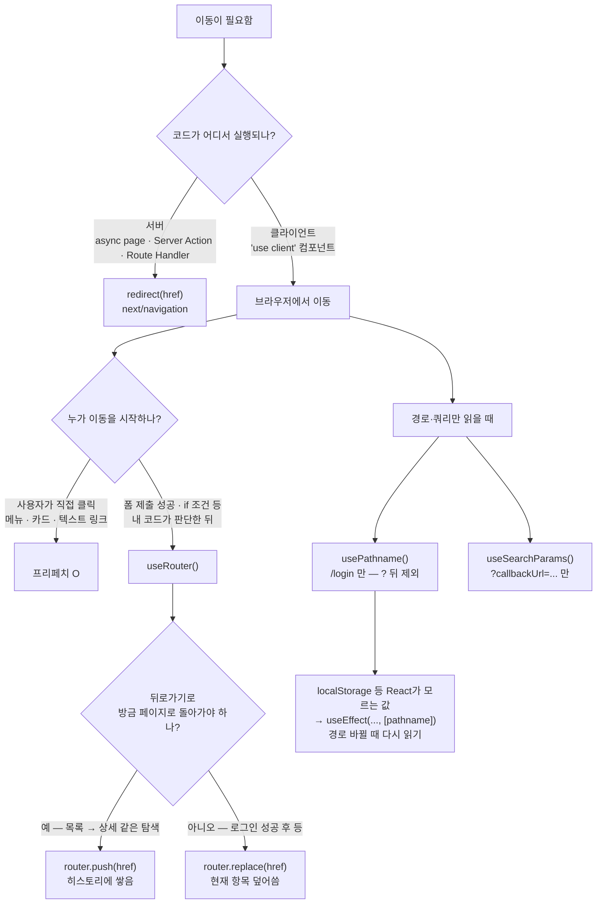


### 예시 — 로그인 · AppHeader

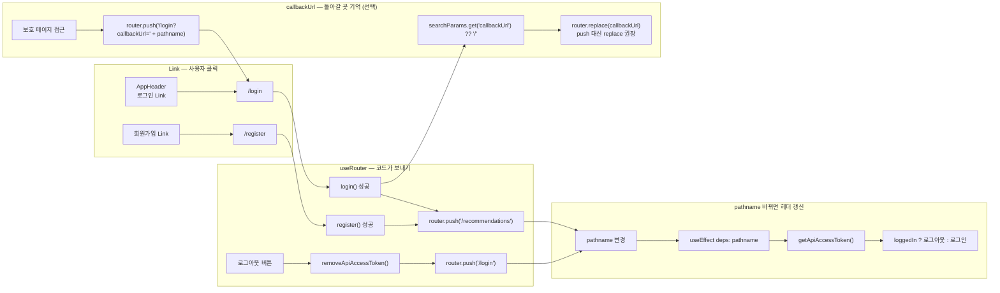


| 키워드                 | 한 줄                                                  |
| ------------------- | ---------------------------------------------------- |
| `<Link>`            | 사용자 클릭 이동 — 프리페치 O                                   |
| `useRouter()`       | 코드가 보내는 이동 — `push` / `replace` / `back` / `refresh` |
| `push` vs `replace` | 히스토리에 쌓을지 vs 덮어쓸지 (로그인 성공 후 → `replace` 권장)          |
| `redirect()`        | **서버 전용** — `'use client'` 안에서는 `router.push`        |
| `callbackUrl`       | Next API 아님 — 돌아갈 경로를 쿼리로 기억하는 **관습적 이름**            |


---

## Web components 공통 틀 — `components/recommendations/`

> **한 줄:** URL·`app/`·API는 `recommendations`. 컴포넌트 폴더도 `**components/recommendations/`** — `components/feed/` ❌  
> 컴포넌트 **이름**은 UI 용어 유지 (`FeedCard`, `FeedList`). **경로만 API와 맞춤.

### 폴더 — 도메인별


| 폴더                             | 파일 (예)                         | 역할                                           |
| ------------------------------ | ------------------------------ | -------------------------------------------- |
| `components/recommendations/`  | `FeedCard.tsx`, `FeedList.tsx` | 피드 카드·목록 UI — props = `types.Recommendation` |
| `app/recommendations/new/`     | `page.tsx`, `actions.ts`       | 작성 폼 · Server Action (7단계 Bearer POST)       |
| `app/login/` · `app/register/` | `page.tsx`                     | 가입·로그인 폼 · `api.login`/`register`            |
| `components/layout/`           | `AppHeader.tsx`                | 공통 헤더 — 로그인 Link · 로그아웃 · `layout`           |
| `components/ui/` (예정)          | 공통 버튼 등                        | shadcn 등                                     |


### import 예 (3단계~)

```tsx
import FeedList from '@/components/recommendations/FeedList';
import type { Recommendation } from '@/lib/types';
```

**Server Actions**는 페이지 옆 `actions.ts` — `components/` 안에 `action.ts` ❌ (`routes.md`)

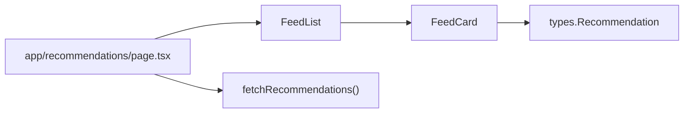


---

## Prisma — `schema.prisma` · ER

> **위치:** `apps/api/prisma/` — **Nest만** (Web ❌). migrate·트러블슈팅 — `[db.md](./db.md)`

### 왜 `authorId` · `userId` 두 개?

**같은 `User`를 가리키지만, 붙는 테이블·역할이 다름.**


| 필요한 기능                   | FK         | 테이블              | API·UI                                   |
| ------------------------ | ---------- | ---------------- | ---------------------------------------- |
| 피드 **@닉네임**              | `authorId` | `Recommendation` | `GET` `include: { author }` → mapper     |
| 글 쓸 때 **작성자 저장**         | `authorId` | `Recommendation` | `POST` + `@UserId()` → `authorId`        |
| **likedByMe** (내가 ♥ 눌렀나) | `userId`   | `Reaction`       | GET reactions + 현재 user `sub` 비교         |
| **중복 좋아요 방지** (나중)       | `userId`   | `Reaction`       | `@@unique([recommendationId, userId])` 등 |


> **6단계까지:** `User`는 로그인만 · 글·♥은 **누구 것인지 DB에 없음** → 피드 `@익명`.  
> **지금:** `Recommendation.authorId` 추가 중 · `Reaction.userId`는 reactions·Heart 때 추가.

### 지금 schema (디스크)


| 모델               | 상태             | 비고                                            |
| ---------------- | -------------- | --------------------------------------------- |
| `User`           | ✅              | email · nickname UK · `passwordHash` · `role` |
| `Recommendation` | ✅ + `authorId` | `author` → `User` · migrate 후 `POST`에 연결      |
| `Reaction`       | ✅ · `userId` ⬜ | `recommendationId`만 · 좋아요 누른 사람 FK 예정         |


### id · FK 타입


|     | `schema.prisma`                         | PostgreSQL                    |
| --- | --------------------------------------- | ----------------------------- |
| PK  | `String @id @default(uuid(7)) @db.Uuid` | `uuid` v7                     |
| FK  | `String @db.Uuid` + `@relation`         | 부모 `id`와 동일 타입 · `@default` ❌ |


### ER — User · Recommendation · Reaction

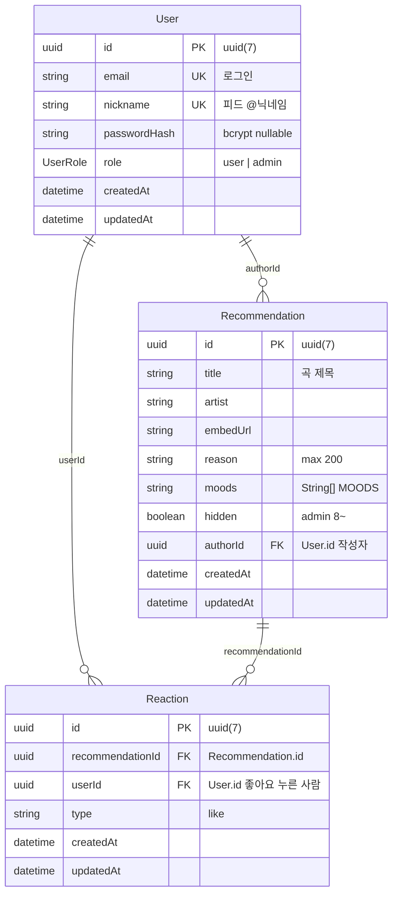


**관계 한 줄**


| 관계                            | 카디널리티 | 의미                               |
| ----------------------------- | ----- | -------------------------------- |
| `User` → `Recommendation`     | 1 : N | 한 사람이 글 여러 개 (`authorId`)        |
| `User` → `Reaction`           | 1 : N | 한 사람이 ♥ 여러 개 (`userId`)          |
| `Recommendation` → `Reaction` | 1 : N | 한 글에 ♥ 여러 개 (`recommendationId`) |


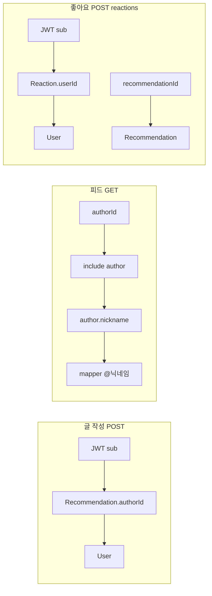


### schema 단계별 추가 (참고)


| 단계     | schema                         | API                                        |
| ------ | ------------------------------ | ------------------------------------------ |
| 2      | `Recommendation` · `Reaction`  | `GET /recommendations`                     |
| 2a     | —                              | `POST /recommendations`                    |
| 6      | `User`                         | `POST /auth/*` · JWT                       |
| **진행** | `authorId` · `Reaction.userId` | `include author` · reactions · `likedByMe` |
| 8      | — (`hidden` 필터)                | Admin                                      |
| 10+    | `Friendship` …                 | `/friends` …                               |


---

## URL · Web fetch

> **규칙:** Web path **= API path** (호스트·포트만 다름). `:id` → `[id]` · 줄임말 `/r` `/new` `/profile` ❌  
> 상세 표·파일명: `[routes.md](./routes.md)` 「네이밍 규칙」

### 피드 vs Recommendation — 헷갈리지 않기


| 말                  | 뜻                            | 어디에 쓰나                                                    |
| ------------------ | ---------------------------- | --------------------------------------------------------- |
| **피드 (feed)**      | 카드 여러 장을 세로로 스크롤하는 **화면·UI** | `/recommendations` 페이지 · `FeedList` · `FeedCard` · “피드 탭” |
| **Recommendation** | 피드에 올라가는 **글 1건** (오늘의 한곡)   | Prisma `Recommendation` · API JSON · `ApiRecommendation`  |


**한 줄:** URL·API path는 `**/recommendations`** 로 통일. **피드 = 보는 쪽**, **Recommendation = 저장·전송하는 글 1건.

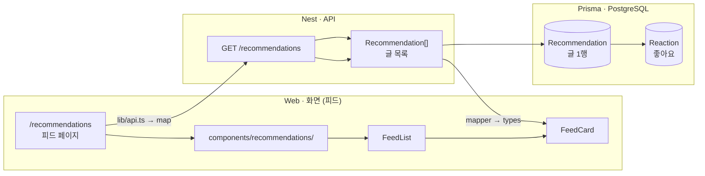


### Web URL ↔ API (같은 세그먼트)

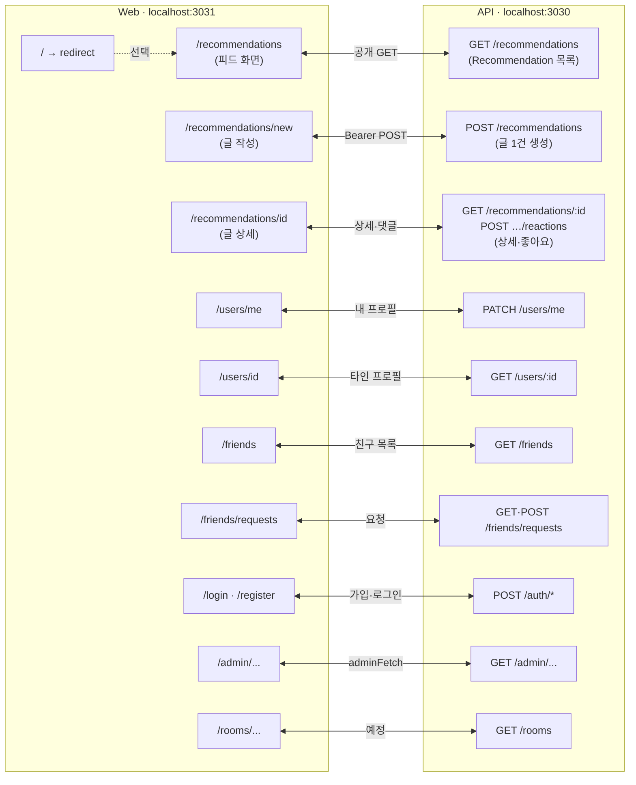


### `app/` 폴더 — URL에 뭐 넣나

```mermaid
flowchart TB
    ROOT["apps/web/app/"]

    ROOT --> REC["recommendations/"]
    REC --> REC_P["page.tsx<br/>/recommendations (피드)"]
    REC --> REC_N["new/<br/>page.tsx · actions.ts<br/>/recommendations/new (작성)"]
    REC --> REC_I["[id]/page.tsx<br/>/recommendations/id (상세)"]

    ROOT --> USR["users/"]
    USR --> USR_ME["me/<br/>/users/me"]
    USR --> USR_ID["[id]/page.tsx<br/>/users/id"]

    ROOT --> FR["friends/"]
    FR --> FR_P["page.tsx · actions.ts<br/>/friends"]
    FR --> FR_R["requests/page.tsx<br/>/friends/requests"]

    ROOT --> AUTH["login/ · register/<br/>/login · /register"]
    ROOT --> ADM["admin/...<br/>/admin/..."]
    ROOT --> RM["rooms/... (예정)"]
    ROOT --> PG["page.tsx (선택)<br/>/ → /recommendations (피드)"]

    ROOT --> API_NEST["api/ ❌ 비즈니스 API 없음<br/>Nest 3030만"]
```


### URL 정리


| 용도      | path                    |
| ------- | ----------------------- |
| 로그인     | `/login`                |
| 회원가입    | `/register`             |
| 피드 (목록) | `/recommendations`      |
| 글 작성    | `/recommendations/new`  |
| 글 상세    | `/recommendations/[id]` |
| 내 프로필   | `/users/me`             |
| 타인 프로필  | `/users/[id]`           |


### Web fetch — Bearer 여부


| 파일                  | Bearer | 예                                                                                   |
| ------------------- | ------ | ----------------------------------------------------------------------------------- |
| `lib/fetchApi.ts`   | —      | `getApiBaseUrl()` — `api.ts` · `authFetch` 공용 (지금은 URL만)                            |
| `lib/api.ts`        | ❌      | `fetchRecommendations` · `login`/`register` (auth는 POST만, 성공 시 `setApiAccessToken`) |
| `lib/authToken.ts`  | —      | `localStorage` `mc_access_token` · get · set · remove                               |
| `lib/authFetch.ts`  | ✅      | `POST /recommendations` · `/friends/*` · `PATCH /users/me`                          |
| `lib/adminFetch.ts` | ✅      | `/admin/*`                                                                          |


---

## 사용자 여정 — 공개 구경 · 참여는 로그인

> **Hard wall 없음** — 방문 즉시 로그인 창 ❌. **Soft gate** — 올리기·♥·친구 추가 시 로그인.  
> 정책 표: `[mvp.md](./mvp.md)` 「접근 정책」· `[auth.md](./auth.md)`


| 상태               | 할 수 있는 것                                      |
| ---------------- | --------------------------------------------- |
| **비로그인 (게스트)**   | 피드 스크롤 · embed 듣기 · (v1) 공개 프로필 보기            |
| **비로그인 → 참여 시도** | `/login?callbackUrl=…`                        |
| **로그인 (회원)**     | 위 + **올리기 · 좋아요 · 친구 추가** — **피드만으로 제한하지 않음** |


```mermaid
flowchart TD
    A["방문 /recommendations"] --> PUB["피드 · embed<br/>비로그인 OK"]

    PUB --> Q{"참여 시도?<br/>올리기 · ♥ · 친구 추가"}
    Q -->|구경만| PUB
    Q -->|예| D["/login · /register<br/>소셜 + 이메일"]

    D --> E["(v1) 필수 약관 동의"]
    E --> M["로그인됨 — 전체 참여"]

    D -->|이메일 가입| D1["/register 닉네임 입력"]
    D -->|소셜| D2["이메일 @ 앞 = nickname 자동"]
    D1 --> M
    D2 --> M

    M --> H["/recommendations/new 오늘의 한 곡 작성"]
    H --> I["Turnstile 검증"]
    I --> J{"AI 작성 도움? v1.5"}

    J -->|사용| K["Claude 작성 도우미"]
    J -->|미사용| L["직접 작성"]

    K --> N["추천 게시 → 피드 노출"]
    L --> N

    M --> O["좋아요"]
    M --> P["댓글 v1"]
    M --> Q2["/rooms 그룹방 v1"]
    M --> R["/friends 친구 v1"]
    M --> S["/users/me 마이페이지 · 닉네임 변경"]

    R --> R1["피드 @닉네임 → /users/id → 친구 추가"]
    R --> T["친구 피드 탭 v2<br/>친구 있을 때만 글 채움"]
    Q2 --> U["방장 운영"]

    V["일대일 DM · 보류"] -.-> M
```


> **친구 피드 탭 (v2)** — 로그인 사용자 전용 **탭**이며, 친구가 없으면 빈 목록일 뿐 **전체 피드 접근을 막는 규칙이 아님**.

---

## 배포

**첫 배포 시점: 7단계 직후 (7.5)** — 피드·가입·글·좋아요 E2E가 된 뒤. **포트폴리오·데모 URL**용. Admin(8)·친구(10) 전에 올려도 됨.


| 단계                   | 구성                                                                           | 비고                 |
| -------------------- | ---------------------------------------------------------------------------- | ------------------ |
| **첫 배포 (MVP·포트폴리오)** | **Vercel** (Web) + **Railway** (Nest API) + **Railway Postgres** 또는 **Neon** | AWS 미사용 — 비용·설정 최소 |
| **이미지·S3·앱 본격**      | API **AWS ECR/Fargate** 검토 · DB **RDS/Neon** · Web **Vercel** 유지             | S3·운영 규모 필요할 때만    |


```mermaid
flowchart LR
    subgraph NOW["첫 배포 7.5"]
        V["Vercel<br/>Next.js"]
        R["Railway<br/>Nest API"]
        DB[("Neon 또는<br/>Railway Postgres")]
        V -->|HTTPS + Bearer| R
        R --> DB
    end

    subgraph LATER["나중 · S3·앱"]
        V2["Vercel Web"]
        AWS["AWS ECR/Fargate<br/>Nest"]
        S3["S3 · CDN"]
        V2 --> AWS
        AWS --> S3
    end

    NOW -.->|필요 시| LATER
```


**7.5 할 일 (요약)**


|        |                                                       |
| ------ | ----------------------------------------------------- |
| Web    | Vercel · `NEXT_PUBLIC_API_URL` = Railway API URL      |
| API    | Railway · `FRONTEND_URL` = Vercel origin · CORS       |
| DB     | Neon/Railway `DATABASE_URL` · `prisma migrate deploy` |
| API 빌드 | `apps/api/Dockerfile` 또는 Railway 빌드                   |


---

## 문서 맵 (주제별)


| 파일                                    | 언제 보나                                                        |
| ------------------------------------- | ------------------------------------------------------------ |
| `**overview.md`**                     | **큰 틀** — 기술 스택 · 역할 분담·개발 순서 · Nest/Web 공통 틀                |
| `struct.md`                           | 단계별 체크리스트 · FeedCard 변수 · 트러블슈팅                              |
| `routes.md`                           | URL · `app/` · `components/` · 네이밍                           |
| `changelog.md`                        | **진행·완료·날짜** 메모 (로컬)                                         |
| `dto.md`                              | DTO · ValidationPipe                                         |
| `db.md`                               | Prisma · migrate · ER                                        |
| `install.md`                          | pnpm · Docker · env                                          |
| `mvp.md`                              | MVP 범위 · 태그 목록                                               |
| `auth.md` · `api_auth_flow.md`        | JWT · `JwtAuthGuard` · `@Roles` · `RolesGuard` · Bearer (6~) |
| `profile.md`                          | 닉네임 · `/users/me`                                            |
| `friends.md` · `chat.md` · `admin.md` | 8단계 이후 도메인                                                   |
| `date.md` · `color.md` · `icons.md`   | FeedCard UI (5단계~)                                           |


