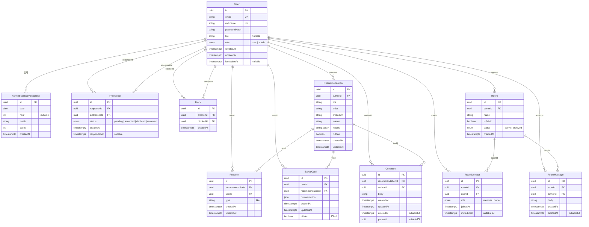
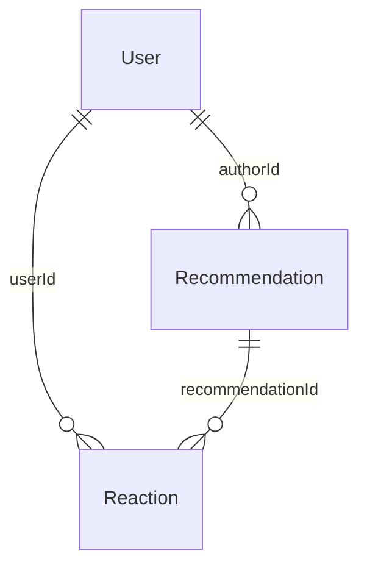
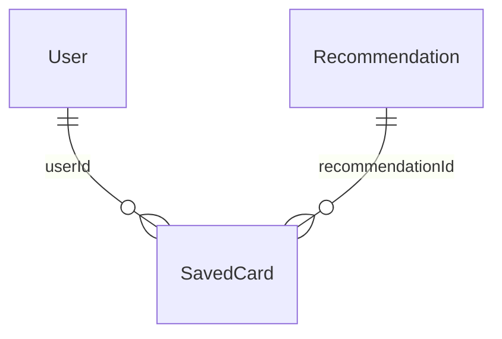
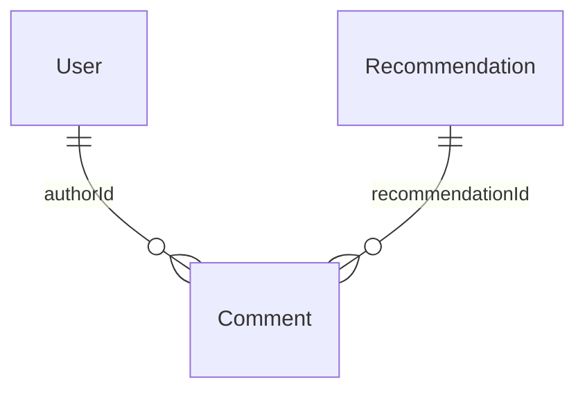
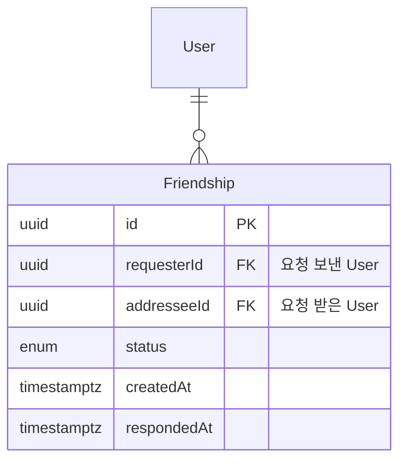
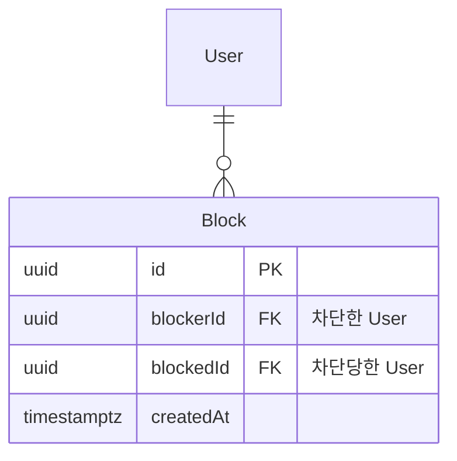
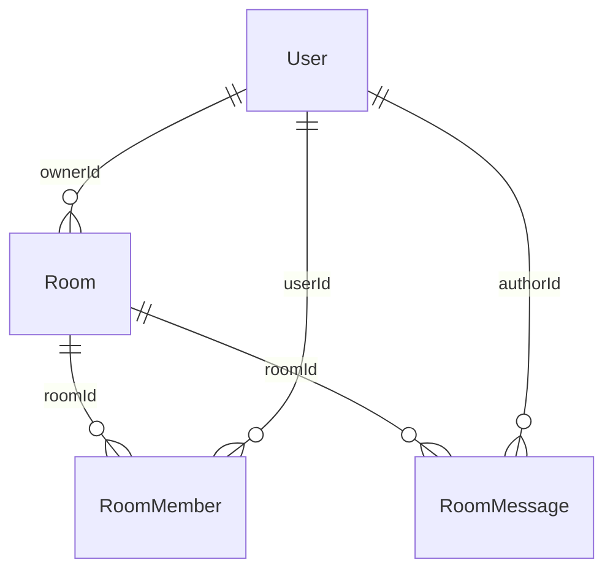

---
aliases:
  - MusicCommunity DB
  - music-community-db
  - DB
  - ER
  - Schema
tags:
  - Project
related:
  - "[[00_Project_HomePage]]"
---

# MusicCommunity — DB · ER

## 전체 로드맵 (한 장)

 `User`↓`AdminStatsDailySnapshot` 선은 **배치용** (FK 없음 · 집계 테이블)



> ER 선 `recId` = 필드 `recommendationId` · `집계` 선 = FK 없음 (Snapshot을 User 아래로 붙이기)


**제약**

| 모델 | |
| --- | --- |
| `Reaction` | `@@unique([recommendationId, userId])` |
| `SavedCard` | `@@unique([userId, recommendationId])` · Cascade |
| `Friendship` | `requesterId ≠ addresseeId` · `@@unique([requesterId, addresseeId])` |
| `Block` | `@@unique([blockerId, blockedId])` |
| `RoomMember` | room + user 유일 |
| `AdminStatsDailySnapshot` | `@@unique([date, hour, metric])` · **FK 없음** |

---

## 헷갈리면

|                                                 |                                                                   |
| ----------------------------------------------- | ----------------------------------------------------------------- |
| `User.id` vs `Friendship.id`                    | **사람** PK ≠ **관계 row** PK                                         |
| `authorId` vs `Reaction.userId`                 | 글 **작성자** vs ♥ **누른 사람**                                          |
| `Recommendation.authorId` vs `SavedCard.userId` | 글 **작성자** vs 앨범에 **저장한 사람** (다를 수 있음)                             |
| `Recommendation` vs `SavedCard`                 | 피드 **글** vs 마이페이지 **포토카드** — 곡 데이터는 `Recommendation` join         |
| `createdAt` vs `lastActiveAt`                   | **가입** vs **마지막 인증 활동** —                                         |
| `User.role` vs 방장                               | `user` \| `admin` **만** — 방장 = `Room.ownerId` / `RoomMember.role` |
| `Friendship` vs `Block`                         | 맞친구 **요청·수락** vs **차단** — 테이블 분리 —                                |
| `Block.id` vs `blockerId`                       | 차단 row PK ≠ `User.id` — `blockerId`/`blockedId`가 사람 FK            |
| **Chat**(기능) vs `Comment` vs `RoomMessage`      | 피드 댓글 = `Comment` · 방 채팅 = `RoomMessage`                          |
| `Comment.createdAt` vs `updatedAt`              | **최초 작성** vs **수정** (`body` PATCH 시 `@updatedAt`) — `Recommendation`과 동일 |
| Prisma `DateTime` vs ER `timestamptz`           | schema 타입명 `DateTime` · DB `@db.Timestamptz(3)`                   |

---

## 1. 핵심



| FK | 의미 |
| --- | --- |
| `Recommendation.authorId` | 글 쓴 사람 |
| `Reaction.userId` | 좋아요 누른 사람 (작성자와 다를 수 있음) |
| `Reaction.recommendationId` | 어떤 글에 대한 반응인지 |

---

## 2. SavedCard



**데이터 나누기**

| 어디 | 뭐가 들어감 |
| --- | --- |
| `Recommendation` | `title` · `artist` · `reason` · `moods` · `createdAt` (올린 날) |
| `SavedCard` | `userId` · `createdAt` (저장한 날) · `customization` |
| `customization.display` | 위 필드 **보일지/숨길지** (boolean만 — 값은 join) |

**`customization` 예**

```json
{
  "display": {
    "title": true,
    "artist": true,
    "reason": false,
    "moods": true,
    "postedAt": false,
    "savedAt": false
  },
  "background": "#e4eff5",
  "backgroundImage": null,
  "layout": "music-strip",
  "playerBar": "#335b73",
  "textColors": {
    "title": "#ffffff",
    "artist": "#e2e8f0",
    "reason": "#475569",
    "moods": "#335b73"
  },
  "stickers": []
}
```

| `display.*` = true | 실제 값 출처 |
| --- | --- |
| `title` · `artist` · `reason` · `moods` | `Recommendation` |
| `postedAt` | `Recommendation.createdAt` |
| `savedAt` | `SavedCard.createdAt` |

| `customization` 키 | 역할 |
| --- | --- |
| `display` | 필드 on/off |
| `background` · `backgroundImage` | 카드 배경 |
| `layout` | `music-strip` (기본) \| `poster` |
| `playerBar` · `textColors` | music-strip 색 |
| `stickers` | ⬜ v2 |

> ⬜ v2 `SavedCard.hidden` — `display`와 별개 · 타인 프로필에서 숨김

---

## 3. `createdAt` vs `lastActiveAt`

둘 다 `User`에 있지만 **의미가 다름**.

| 필드 | 의미 | 언제 채워짐 |
| --- | --- | --- |
| `createdAt` | **가입** 시각 · 불변 | 회원가입 |
| `lastActiveAt` | **마지막 인증 활동** · nullable | login · Guard 인증 API (가입만으로는 null) |

```txt
가입만 하고 안 돌아옴     → lastActiveAt = null
어제 왔는데 오늘 안 옴   → lastActiveAt < 오늘 00:00 KST
```

Admin DAU·미접속 필터는 **`lastActiveAt`** 기준 

---

## 4. AdminStatsDailySnapshot

User·Recommendation과 **FK 없음** — cron이 쌓는 **집계 히스토리**만.

| 필드 | 의미 |
| --- | --- |
| `date` | `@db.Date` — 집계 **일자** |
| `hour` | `null` = 일 합계 · `0`~`23` = 시간대 |
| `metric` | `recommendations` \| `signups` \| `dau` |
| `count` | 해당 버킷 건수 |

| `metric` | 집계 대상 |
| --- | --- |
| `recommendations` | `Recommendation.createdAt` |
| `signups` | `User.createdAt` |
| `dau` | `User.lastActiveAt` |

---

## 5. `Comment` — 피드 댓글



| 필드 | |
| --- | --- |
| `recommendationId` | 어떤 추천 글 아래 |
| `authorId` | 댓글 작성자 |
| `body` | 텍스트 + 이모지 · **수정 가능** (본인) |
| `createdAt` | 최초 작성 |
| `updatedAt` | 마지막 수정 — `Recommendation` · `SavedCard`와 같이 `@updatedAt` |
| `parentId` ⬜ | 대댓글 1단계 |
| `deletedAt` ⬜ | soft delete (12는 hard `DELETE` 가능) |


---

## 6. Friendship · Block

> `User` ↔ `Friendship` / `Block` 은 **FK가 각 2개**라 선 라벨을 두면 Mermaid에서 겹침 → FK는 **테이블 안**에 표기.

**Friendship**



| 필드 (`Friendship`) | |
| --- | --- |
| `requesterId` | 요청 **보낸** 사람 |
| `addresseeId` | 요청 **받은** 사람 |
| `status` | `pending` → `accepted` / `declined` / `removed` |
| `respondedAt` | 수락·거절 시각 |

**Block**



**Block** — `Friendship`과 **섞지 않음**

```txt
A가 B 차단 → Block { blockerId=A, blockedId=B }
Block.id     = 이 row의 PK (User.id 아님)
```

| | `Friendship` | `Block` |
| --- | --- | --- |
| 의미 | 맞친구 | 차단 |
| 방향 | `requester` → `addressee` | `blocker` → `blocked` |
| 상태 | enum | 없음 — row 있으면 차단 중 |
| A→B 와 B→A | 요청 row 각각 | 차단 row 각각 |

`User` relation: `sentFriendRequests` · `receivedFriendRequests` · `blocksInitiated` · `blocksReceived`

---

## 7. Room · RoomMessage



| 모델 | 핵심 |
| --- | --- |
| `Room` | `ownerId` = 방 만든 사람 |
| `RoomMember` | `role`: `member` \| `owner` — **방장은 여기** |
| `RoomMessage` | 방 안 채팅 한 줄 (`Comment`와 별도 테이블) |

> 방장 ≠ `User.role`
